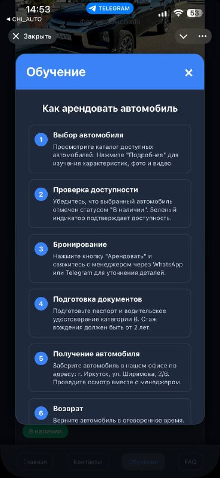
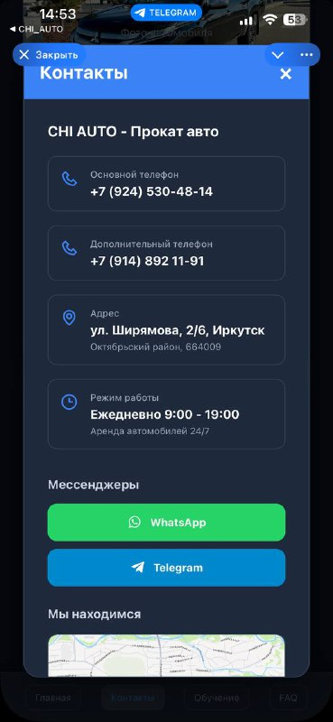
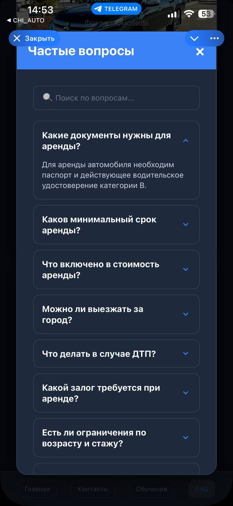
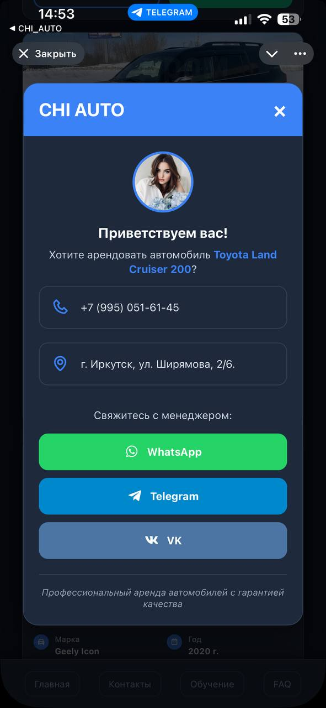
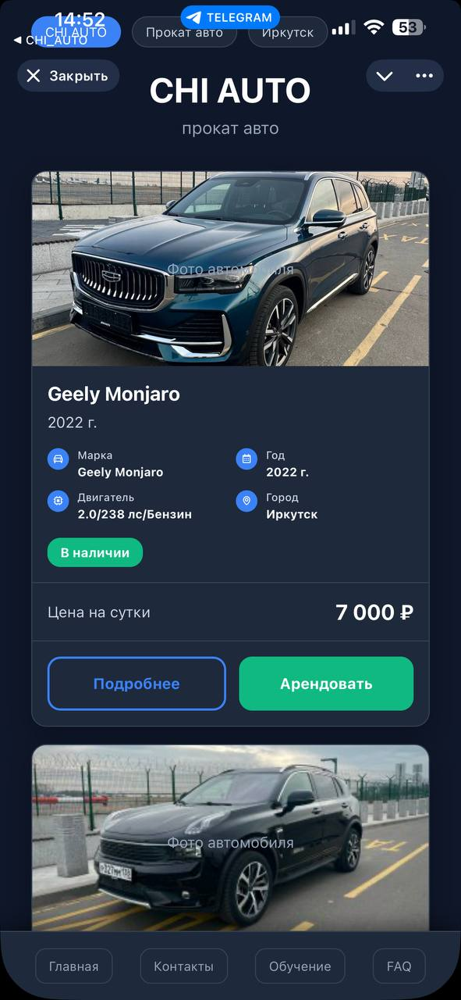

# CHI AUTO — Прокат авто (Flask)

<p align="center">
  
</p>

<p align="center">
  <b>Мини‑веб‑приложение для проката автомобилей:</b><br/>
  каталог авто • карточки с ценой/условиями • модальные окна (аренда/контакты/FAQ) • мобильный современный UI
</p>

<p align="center">
  <a href="#-возможности">Возможности</a> •
  <a href="#-технологии">Технологии</a> •
  <a href="#-запуск">Запуск</a> •
  <a href="#-структура-проекта">Структура</a> •
  <a href="#-скриншоты">Скриншоты</a>
</p>

---

## ✨ Возможности

- **Каталог автомобилей** с карточками и статусом доступности  
- **Страницы конкретных авто** (маршруты вида `/car/<model>`)
- **Модалка “Аренда”** — быстрый контакт с менеджером через мессенджеры  
- **FAQ** с поиском по вопросам  
- **Контакты** с телефоном, адресом, режимом работы и картой  
- **Mobile‑first дизайн** в темной теме

---

## 🧰 Технологии

- **Backend:** Python + Flask  
- **Frontend:** HTML + Jinja2  
- **UI:** кастомный CSS (темная тема, карточки, модальные окна, фиксированная нижняя навигация)  
- **Иконки:** Boxicons (CDN)

---

## 🚀 Запуск

> Требования: Python 3.10+ (рекомендуется)

1) Установи зависимости:

```bash
pip install -r requirements.txt
```

2) Запусти сервер:

```bash
python app.py
```

3) Открой в браузере:

- `http://127.0.0.1:5000/`

> По умолчанию приложение запускается в режиме `debug=True`.

---

## 🗺️ Основные маршруты

- `/` — каталог автомобилей  
- `/contacts` — контакты  
- `/tutorial` — обучение (как арендовать)  
- `/faq` — частые вопросы  
- `/rent-modal` — окно аренды (вспомогательный шаблон)  
- `/car/...` — карточки конкретных авто, например:
  - `/car/geely-monjaro`
  - `/car/toyota-land-cruiser-200`
  - `/car/mitsubishi-l200`
  - и другие

---

## 📁 Структура проекта

Примерная структура (как в проекте):

```
.
├── app.py
├── requirements.txt
├── templates/
│   ├── index.html
│   ├── contacts.html
│   ├── tutorial.html
│   ├── faq.html
│   ├── rent_modal.html
│   └── car_*.html
└── static/
    ├── css/
    │   └── style.css
    └── images/
        └── *.jpg / *.png
```

---

## 🖼️ Скриншоты

<p align="center">
  
  
  
</p>

<p align="center">
  
  
</p>

<details>
  <summary><b>Идеи, как прокачать проект дальше</b></summary>

- Подключить базу данных (SQLite/PostgreSQL) и админ‑панель для управления автопарком  
- Добавить бронирование по датам + календарь, занятость и уведомления  
- Вынести автомобили в JSON/YAML и генерировать страницы динамически  
- Сделать API + интеграцию с Telegram‑ботом для брони  
- Добавить CI (lint/format), Dockerfile и деплой на VPS/Render

</details>

---

## 📌 Примечания

- Изображения в README лежат в папке `readme_assets/` — **можно удалить**, это только для красивого описания.
- Если будешь выкладывать на GitHub — просто закоммить README вместе с `readme_assets/`.

---

## 📄 Лицензия

Сергей.
